## An guide to this (unofficial) set of Otago themes for R graphs

I am sharing my (unofficial) work-in-progress for creating R graph themes in Otago colours and fonts. To use them I suggest you download the repo and use a local copy, rather than trying to draw it in live from github, as this is an under development copy.

These themes use Open Sans, as one of the recommended onscreen fonts, so you are going to need Open Sans (unless you modify the themes to something else).
Open Sans is available at https://fonts.google.com/specimen/Open+Sans?selection.family=Open+Sans and click on Family Selected in the lower right of the screen, then the download downward pointing arrow in the upper right of the pop-up area.

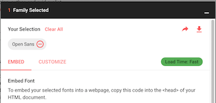

I should also be honest and say I haven't actually tested this much on Windows yet, but on the one machine I checked it worked OK.

It is not yet a package, or anything like that, so I am just loading everything with a source command


```r
source("otago_themes.R")
```


## Colours

The web (RGB hexadecimal) 4 main colours are in pal_otago if people want to access them in the form `pal[1]` etc. Because Otago includes colours in the red spectrum, I am deliberately avoiding green to minimise red/green colourblindness issues.


```r
# example 1, showing the colours
plot(1:8, rep(1,8), pch=16, col=pal_otago[1:8], cex=3)
```

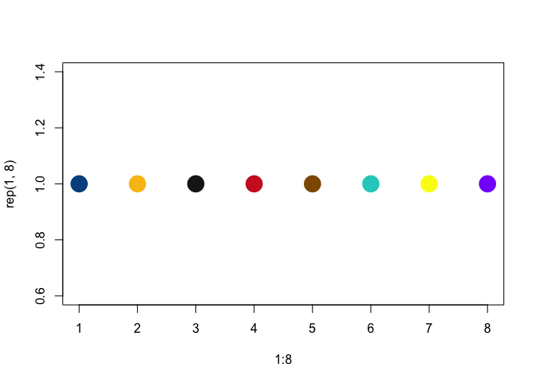<!-- -->


```r
# example 2 a single colour
plot(1:8, rep(1,8), pch=16, col=pal_otago[4], cex=3)
```

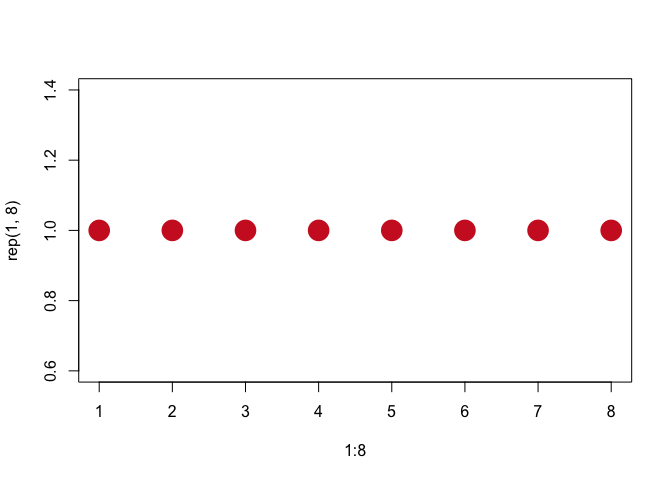<!-- -->


```r
# Example 3 with a factor, ggplot
df <- data.frame(xcord=1:9,ycord=rep(c(1,2,1),3), fct=factor(rep(letters[1:3], each=3)))
library(ggplot2)
ggplot(df, aes(x=xcord, y=ycord, colour=fct)) + geom_line() +
  scale_colour_manual(values = pal_otago)
```

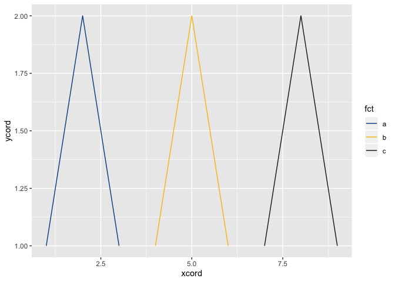<!-- -->


```r
# Example 4 with continuous data, using ggplot and scale_colour_viridis(option="plasma")
ggplot(df, aes(x=xcord, y=ycord, colour=xcord)) + geom_line(colour=pal_otago[3]) +
  geom_point(size=4) +
  scale_colour_viridis_c(option="plasma", end=0.94)
```

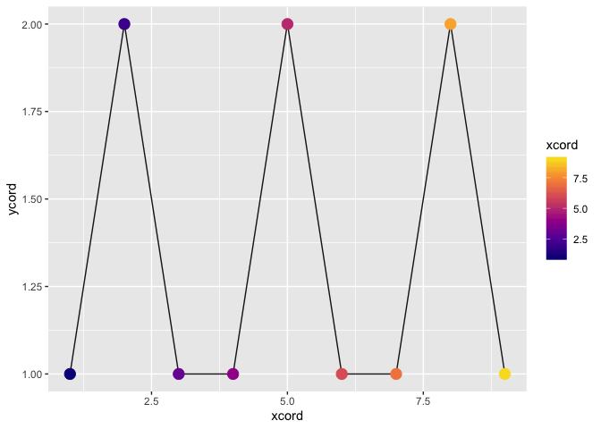<!-- -->

## Themes

These themes both set colours and use the Open Sans font

### theme_otago_o

A theme for single panel graphs using Otago colours and Open Sans


```r
# Example 5  theme_otago_o
ggplot(df, aes(x=xcord, y=ycord, colour=xcord)) + geom_line(colour=pal_otago[3]) +
  geom_point(size=4) +
  scale_colour_viridis_c(option="plasma", end=0.94) +
  theme_otago_o + ggtitle("A graph of things") +
  labs(caption = "source: because listing the data source is good")
```

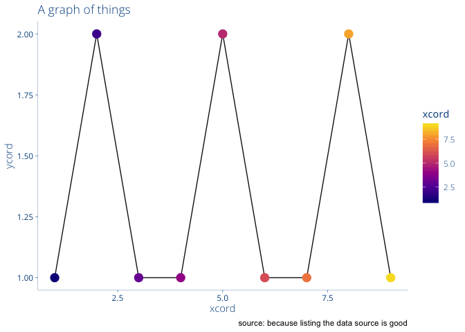<!-- -->

### theme_otago_facet_o

A theme for multipanel graphs using Otago colours and Open Sans- the only real difference is that the plot background is a very faint shade of grey to distinguish the panel areas (in turn, so it is clear which panel headings belong to which panels)


```r
# Example 5  theme_otago_o
ggplot(df, aes(x=xcord, y=ycord, colour=xcord)) + geom_line(colour=pal_otago[3]) +
  geom_point(size=4) +
  scale_colour_viridis_c(option="plasma", end=0.94) +
  theme_otago_facet_o + ggtitle("A graph of things") +
  labs(caption = "source: because listing the data source is good") +facet_wrap(~fct, nrow=2)
```

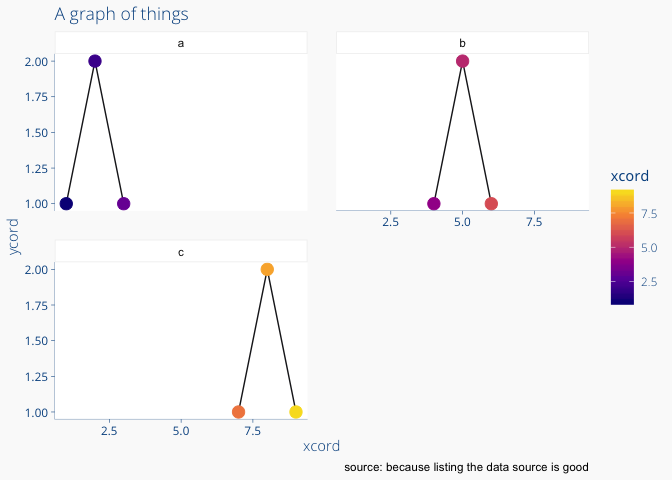<!-- -->

as with normal themes, to suppress the legend, and your own theme settings after adding the otago one (so they act as overrides). Same principle for any other personal tweaks.


```r
# Example 6  overriding theme_otago_o
ggplot(df, aes(x=xcord, y=ycord, colour=xcord)) + geom_line(colour=pal_otago[3]) +
  geom_point(size=4) +
  scale_colour_viridis_c(option="plasma", end=0.94) +
  theme_otago_facet_o + ggtitle("A graph of things") +
  labs(caption = "source: because listing the data source is good") +
  facet_wrap(~fct, nrow=2) + theme(legend.position = "none")
```

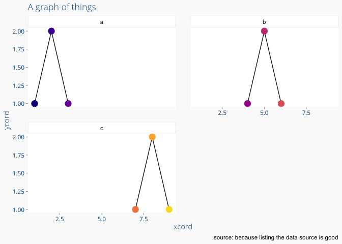<!-- -->

### theme_otago_pptdrw

This theme is intended for use with the "export" package, to put a ggplot graph into a PowerPoint file as a vector drawing so there is no loss of quality. The down side is that as the text is still fonts, you need the same fonts on the display computer (so, normal PowerPoint issues). The up is is getting rid of the nagging, tiny amount of fuzziness you get in images. Side note: on a Mac, 'export' is a package that need xquartz installed.


```r
library(export)
slide <- ggplot(df, aes(x=xcord, y=ycord, colour=xcord)) + geom_line(colour=pal_otago[3]) +
  geom_point(size=4) +
  scale_colour_viridis_c(option="plasma", end=0.94) +
  theme_otago_pptdrw + ggtitle("A graph of things") +
  labs(caption = "source: because listing the data source is good")
pptxfile <- file.choose() #pick a pptx file or hard code the path instead
graph2ppt(x=slide, file=pptxfile, append = TRUE, width=24, height=18)
```

This is how it looks in PowerPoint:

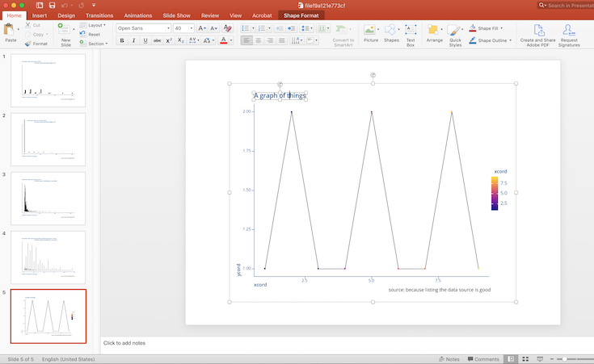

But as, at time of writing this, I only discovered the export package yesterday, I would not consider this finished.

### theme_otago_facet_pptdrw

This is the facet version of the PowerPoint vector drawing theme, again creating a soft grey plot background to make the facets and their headings clear. Used the same as the non-facet version in combination with the export package.


```r
slide <- ggplot(df, aes(x=xcord, y=ycord, colour=xcord)) + geom_line(colour=pal_otago[3]) +
  geom_point(size=4) +
  scale_colour_viridis_c(option="plasma", end=0.94) +
  theme_otago_facet_pptdrw + ggtitle("A graph of things") +
  labs(caption = "source: because listing the data source is good") +facet_wrap(~fct, nrow=2)
pptxfile <- file.choose() #pick a pptx file or hard code the path instead
graph2ppt(x=slide, file=pptxfile, append = TRUE, width=24, height=18)
```

This is the faceted version in PowerPoint

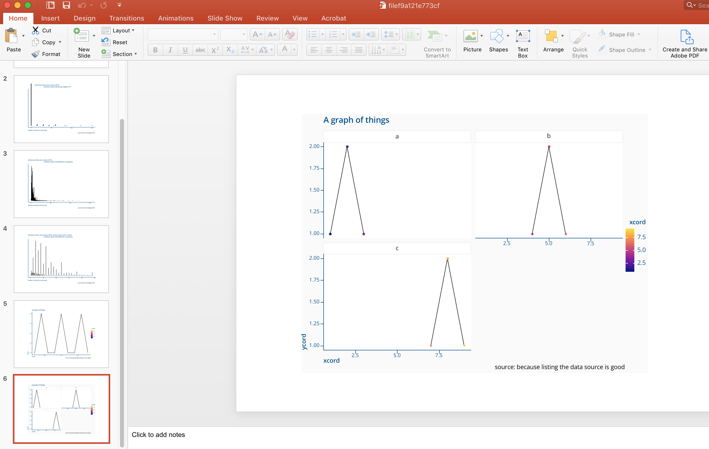

### theme_otago_facet_pptimg

This is a facet version theme that was intended for saving as a very large high-quality image for putting into PowerPoint, that I was working on yesterday just before discovering the export package. So it is, perhaps, the least finely tweaked (because I began exploring the export package)


```r
slide <- ggplot(df, aes(x=xcord, y=ycord, colour=xcord)) + geom_line(colour=pal_otago[3]) +
  geom_point(size=4) +
  scale_colour_viridis_c(option="plasma", end=0.94) +
  theme_otago_facet_pptimg + ggtitle("A graph of things") +
  labs(caption = "source: because listing the data source is good") +facet_wrap(~fct, nrow=2)
ggsave(filename="slide.png", plot=slide, width=16, height=9, unit="in", type="cairo", dpi=300)
```

Here is a (very reduced in size after creating it, and so fuzzier due to compression) version of the faceted image file:

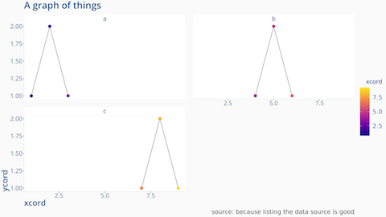


